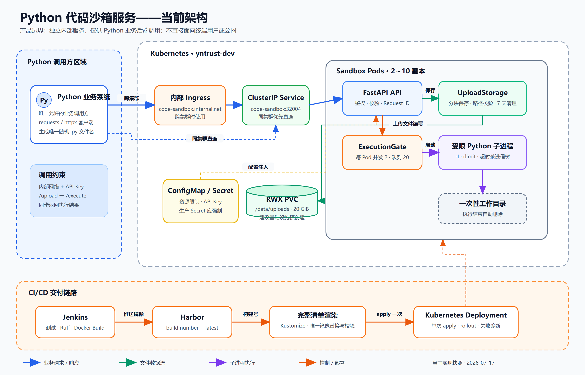

# Python 代码沙箱服务技术方案讨论稿

> 文档状态：基于 2026-07-17 当前代码与部署清单整理，用于方案评审，不等同于最终生产验收报告。

## 1. 方案摘要

当前方案是一个独立部署的内部 Python 代码运行服务。它接收 Python 业务系统上传的 `.py` 文件，在受限子进程中同步执行，并返回 `stdout`、`stderr`、退出码和执行状态。

最重要的边界是：**该服务只提供给 Python 业务后端调用，不直接提供给浏览器、终端用户或其他外部客户端。**

从协议上看，它仍然是 HTTP API，任何能发 HTTP 请求的程序理论上都能调用。因此“仅 Python 方调用”目前属于产品边界和部署边界，生产环境还需要通过 ClusterIP、Ingress 白名单、NetworkPolicy、API Key 或服务网格策略落实。

当前实现采用“常驻 FastAPI 服务 + 每次请求创建独立 Python 子进程”的方式，重点是低启动延迟和内部受控场景下的资源限制。它不是虚拟机级强隔离沙箱，不适合直接运行完全不可信的公网用户代码。

## 2. 建设目标与非目标

### 2.1 当前目标

- 为 Python 业务系统提供稳定、简单的代码上传与执行接口。
- 避免把长 Python 代码直接放入 JSON，减少换行和转义问题。
- 每次执行使用独立临时目录和独立子进程。
- 限制执行时间、并发量、内存、CPU 时间、进程数、文件大小和输出大小。
- 支持 Kubernetes 多副本部署和水平扩容。
- 对错误、超时和系统繁忙提供明确返回值。

### 2.2 当前非目标

- 不直接面向终端用户或公网开放。
- 不支持 Java、Node.js、Shell 等其他语言运行时。
- 不提供长任务、断点续跑、任务队列和异步结果查询。
- 不提供虚拟机级或 Kata Containers 级强隔离。
- 不保证任意第三方 Python 包都能联网访问外部数据源。

## 3. 当前总体架构



[查看 SVG 原图](./diagrams/code-sandbox-architecture.svg)

架构分为两条链路：

- 运行链路：Python 业务系统通过内部网络调用沙箱 API，完成上传和执行。
- 交付链路：Jenkins 构建镜像、推送 Harbor，再使用 Kustomize 清单部署到 Kubernetes。

## 4. 调用方边界

### 4.1 唯一调用方

唯一业务调用方是 Python 后端服务。推荐在 Python 侧封装统一客户端，不允许各业务模块自行拼接请求。

推荐访问顺序：

1. 同集群调用优先使用 ClusterIP：`http://code-sandbox.yntrust-dev.svc.cluster.local:32004`。
2. 跨集群调用才使用内部 Ingress：`http://code-sandbox.internal.net`。
3. 不对浏览器和终端用户暴露 API Key。

### 4.2 Python 调用示例

```python
import uuid

import requests


BASE_URL = "http://code-sandbox.yntrust-dev.svc.cluster.local:32004"
HEADERS = {"X-API-Key": "从安全配置读取，不要写死在代码中"}

filename = f"generated_{uuid.uuid4().hex}.py"
source = "print('hello from sandbox')\n"

uploaded = requests.post(
    f"{BASE_URL}/upload",
    headers=HEADERS,
    files={"file": (filename, source.encode("utf-8"), "text/x-python")},
    timeout=10,
)
uploaded.raise_for_status()
identity = uploaded.json()

executed = requests.post(
    f"{BASE_URL}/execute",
    headers=HEADERS,
    json={**identity, "timeout": 10},
    timeout=20,
)
executed.raise_for_status()
result = executed.json()
```

调用方必须生成当天不重复的安全文件名，并原样使用 `/upload` 返回的 `date` 和 `filename` 调用 `/execute`。

## 5. API 协议

| 接口 | 鉴权 | 作用 | 主要返回 |
| --- | --- | --- | --- |
| `GET /health` | 无 | 存活检查和当前 Pod 的 active/waiting 数量 | `status`、`active_executions`、`waiting_executions` |
| `POST /upload` | `X-API-Key` | 上传单个 `.py` 文件 | HTTP 201，`date`、`filename` |
| `POST /execute` | `X-API-Key` | 根据上传标识同步执行代码 | HTTP 200，`stdout`、`stderr`、`exit_code`、`status` |

执行状态：

- `success`：子进程退出码为 `0`。
- `error`：子进程非零退出，HTTP 仍为 `200`，实际退出码保留。
- `timeout`：超过执行时间，`exit_code=-1`。

主要 HTTP 错误：

| HTTP 状态 | 含义 |
| ---: | --- |
| 400 | 日期、文件名或 timeout 参数非法 |
| 401 | API Key 缺失或错误 |
| 404 | 上传文件不存在 |
| 409 | 当天同名文件已经存在 |
| 413 | 上传文件超过限制 |
| 429 | 当前 Pod 执行槽或等待队列已满 |
| 500 | 服务内部执行或存储异常，不向调用方返回内部堆栈 |

服务接受调用方传入的 `X-Request-ID`；未传时自动生成，并在响应头中返回，用于串联业务日志和沙箱日志。

## 6. 单次执行生命周期

1. Python 调用方生成唯一 `.py` 文件名并调用 `/upload`。
2. 服务验证文件名、扩展名和上传体积，以独占创建方式写入 `uploads/YYYY-MM-DD/filename.py`，同名文件不会被覆盖。
3. `/upload` 返回日期和文件名。
4. Python 调用方使用这两个字段调用 `/execute`。
5. 服务验证路径并检查文件是否存在。
6. `ExecutionGate` 获取当前 Pod 的执行槽；队列满或等待超时返回 429。
7. 服务把上传文件复制到一次性临时目录。
8. 使用当前 Python 解释器的 `-I` 隔离模式启动全新子进程，并传入最小环境变量。
9. Linux 下设置 CPU 时间、地址空间、进程数、打开文件数和单文件写入大小限制。
10. 持续读取 stdout/stderr，只保留配置允许的最大字节数，避免输出撑爆内存。
11. 超时时先终止进程组，宽限时间后仍未退出则强制杀死整个进程树。
12. 清理临时目录并返回执行结果。

## 7. 组件职责

| 组件 | 当前职责 |
| --- | --- |
| FastAPI API | 鉴权、参数校验、状态映射、请求追踪和响应封装 |
| UploadStorage | 文件名与日期校验、分块上传、同名拒绝、过期文件清理 |
| ExecutionGate | 每 Pod 并发控制、等待队列长度和等待超时控制 |
| SandboxExecutor | 临时工作目录、子进程创建、输出截断、超时和进程树清理 |
| runner.py | Linux 资源限制、切换工作目录、执行目标脚本 |
| RWX PVC | 多 Pod 共享上传文件，使上传和执行可落到不同 Pod |
| ConfigMap / Secret | 运行参数和 API Key 注入 |
| Jenkins / Harbor | 测试、构建、镜像存储和 K8S 发布 |

## 8. 当前资源配置

生产清单中的关键值：

| 项目 | 当前值 |
| --- | ---: |
| Pod 初始副本 | 2 |
| HPA 范围 | 2～10 |
| HPA CPU 目标 | 70% |
| 每 Pod 同时执行 | 2 |
| 每 Pod 等待队列 | 20 |
| 队列等待时间 | 5 秒 |
| 单次最大执行时间 | 30 秒 |
| 单文件上传限制 | 20 MiB |
| stdout/stderr 各自保留上限 | 1 MiB |
| 子进程地址空间限制 | 1 GiB |
| 子进程 CPU 时间 | 30 秒 |
| 子进程数量上限 | 32 |
| 单个可写文件上限 | 20 MiB |
| 打开文件数上限 | 64 |
| 上传文件保留期 | 7 天 |
| PVC 申请容量 | 20 GiB，ReadWriteMany |

按当前配置，正常副本数为 2 时理论同时执行量约为 4；扩到 10 个 Pod 时约为 20。这个数字不等同于完整系统吞吐量，因为任务时长、CPU、Pod 调度、PVC 性能和 Python 包初始化都会影响实际能力。

## 9. 安全边界

### 9.1 已实现的防护

- 文件名只允许安全的 Python basename，拒绝目录分隔符、隐藏文件和非 `.py` 文件。
- 严格校验日期并防止路径逃逸。
- 上传文件分块写入，失败后清理半成品，不覆盖已有文件。
- 每次执行使用独立临时目录，脚本产生的相对路径文件不会写入共享上传目录。
- 子进程不继承父进程完整环境，避免业务 Secret 被代码直接读取。
- Linux 资源限制和 Kubernetes requests/limits 双层约束。
- 超时终止整个进程树。
- 容器使用固定非 root UID/GID、只读根文件系统、RuntimeDefault seccomp、禁止提权并删除全部 capabilities。
- ServiceAccount 不自动挂载 Kubernetes Token。
- NetworkPolicy 当前默认禁止 Pod 主动访问外部网络。
- 内部错误不会把服务端绝对路径或完整堆栈返回给调用方。

### 9.2 明确不具备的能力

- 子进程与 FastAPI 主进程仍处于同一个容器和内核中，不是强隔离边界。
- 没有为每次执行创建独立 Pod、gVisor 或 Kata Containers。
- 没有专门的系统调用白名单、代码静态审查和恶意行为检测。
- API Key 在当前清单中是 optional；如果生产 Secret 未创建，业务接口会变成无鉴权状态。
- “仅 Python 方调用”没有在 HTTP 协议层强制，需要网络和身份策略配合。

因此当前方案只适合可信内部 Python 业务系统提交的 AI 生成代码，不应直接承载完全不可信的公网输入。

## 10. Kubernetes 与存储方案

### 10.1 当前设计

- Deployment 使用 2 个副本，RollingUpdate 为 `maxUnavailable=0`、`maxSurge=1`。
- Service 暴露 32004，Ingress 使用内部域名。
- HPA 根据 CPU 从 2 扩到 10，PDB 保证至少 1 个 Pod 可用。
- `/tmp` 使用 1 GiB `emptyDir`。
- `/data/uploads` 使用 `code-sandbox-uploads` RWX PVC。

### 10.2 当前已发现的部署阻塞

当前 Kustomize 资源中包含 `Namespace` 和 `PersistentVolumeClaim`。Jenkins 使用的 kubeconfig 如果没有创建或修改 PVC 的权限，`kubectl apply` 会返回 `persistentvolumeclaims is forbidden`。

这不是代码执行逻辑错误，而是资源所有权没有分清：PVC、StorageClass 和 Namespace 通常由基础设施或集群管理员管理，应用流水线不一定拥有权限。

### 10.3 推荐讨论结论

推荐把 `yntrust-dev` Namespace 和 `code-sandbox-uploads` PVC 改为基础设施侧预创建：

- 集群管理员选择支持 RWX 的 StorageClass 并创建 PVC。
- 应用 Deployment 继续引用固定 claimName。
- 应用 Kustomize/Jenkins 不再创建或修改 Namespace、PVC。
- Jenkins 部署前只检查这些基础资源存在，不尝试接管所有权。

如果集群没有 RWX 存储，备选方案是对象存储：`/upload` 写对象存储，`/execute` 按对象 Key 下载到临时目录。它比单机 `emptyDir` 更适合多副本，但需要新增对象存储依赖和生命周期管理。

## 11. 网络访问策略

当前 NetworkPolicy 没有配置任何 egress 条目，相当于默认禁止沙箱 Pod 主动访问外部网络。

这与镜像内安装的 `requests`、`httpx`、`yfinance` 等库存在业务上的潜在冲突：代码可以导入这些包，但生产环境不一定能访问行情或第三方 HTTP 服务。

推荐继续坚持默认拒绝，只按业务讨论结果开放：

- DNS 解析所需地址；
- 明确允许的内部数据服务；
- 明确允许的外部域名或代理出口；
- 禁止任意公网访问和内网横向扫描。

## 12. 构建与发布

当前 Jenkins 流程：

1. Checkout。
2. 安装/定位 uv，执行 `uv sync --frozen --group dev`。
3. 执行 pytest、Ruff 和格式检查。
4. 构建带 Jenkins BUILD_NUMBER 的不可变镜像，同时推送 `latest`。
5. 使用 Kustomize 生成完整 Kubernetes 清单。
6. 在最终清单中把唯一的 `:latest` 完整镜像引用替换为本次 `$IMAGE_REF`。
7. 校验最终镜像只出现一次，再 apply 完整清单。
8. 等待 Deployment rollout；失败时输出 Deployment、PVC、Pod、Event 和容器日志。

当前镜像运行特征：Python 3.12、固定非 root 用户 `10001:10001`、tini 作为 PID 1、只包含锁定依赖和 `src/` 代码。

## 13. 当前主要风险与待讨论事项

| 议题 | 当前状态 | 建议 |
| --- | --- | --- |
| 调用方范围 | 产品上限定 Python 后端，协议上未强制 | 优先走 ClusterIP，补充 ingress/NetworkPolicy 白名单和统一 Python SDK |
| PVC 所有权 | 应用清单创建 PVC，集群可能禁止 | 改为基础设施预创建，Jenkins 只检查 |
| API Key | Secret 引用为 optional | 生产环境改为强制 Secret，启动时检查非空 |
| 隔离等级 | 进程级限制，共享容器内核 | 内部受控阶段可接受；扩大信任边界前升级每任务 Pod/gVisor/Kata |
| 网络访问 | 默认完全禁止 egress | 基于明确业务目标做最小白名单 |
| 执行模式 | 同步 HTTP，最长 30 秒 | 继续服务短任务；长任务另建异步 Job/Queue 模式 |
| 全局调度 | 并发和队列都是每 Pod 独立 | 需要精确全局容量时引入共享队列或集中调度器 |
| 文件标识 | `date + filename` | Python SDK 封装；后续可升级为不可猜测 execution/upload ID |
| 可观测性 | 有请求日志和 health 计数 | 增加 Prometheus 指标、成功率、超时率、排队时间和执行时长分位数 |

## 14. 推荐分阶段路线

### 阶段 0：先稳定上线

- 由管理员预创建 Namespace、RWX PVC 和生产 Secret。
- Jenkins 从应用清单中移除基础设施资源管理职责，只做存在性检查。
- 使用 ClusterIP 限制调用范围，确认仅 Python 业务服务可访问。
- 完成一次真实 upload → execute → cleanup 验收。

### 阶段 1：提高可用性

- 提供统一 Python SDK，内置文件名生成、API Key、Request ID、重试和超时策略。
- 增加 Prometheus 指标和告警。
- 压测不同脚本时长下的并发、排队、HPA 和 PVC 性能。
- 明确允许访问的行情/HTTP 数据源并配置最小 egress 白名单。

### 阶段 2：扩大安全边界

- 如果调用方来源变得更复杂，将每次执行迁移到独立 Pod 或专用运行节点。
- 评估 gVisor、Kata Containers、只读依赖镜像和更严格的 seccomp/AppArmor。
- 对长任务引入异步任务 ID、队列、状态查询和结果存储。

## 15. 本次评审建议形成的结论

建议会议至少确认以下问题：

1. 是否正式确认“仅 Python 业务后端调用，禁止终端用户直连”？
2. PVC 是否由基础设施侧预创建，应用流水线只引用？
3. 当前进程级隔离是否满足内部 AI 代码的信任等级？
4. 哪些外部数据源必须开放，哪些网络访问必须继续禁止？
5. 当前同步执行 30 秒是否满足业务，是否存在长任务需求？
6. 生产 API Key 是否改成强制配置？
7. 是否需要统一 Python SDK 和 Prometheus 指标作为上线前置项？
